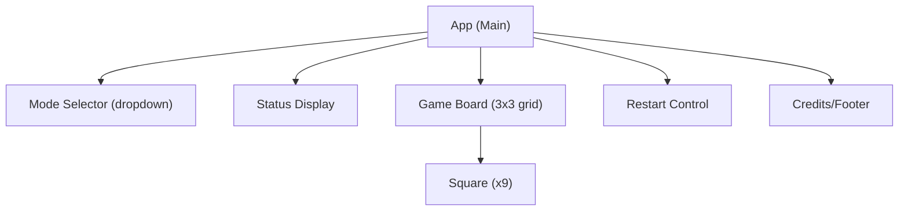
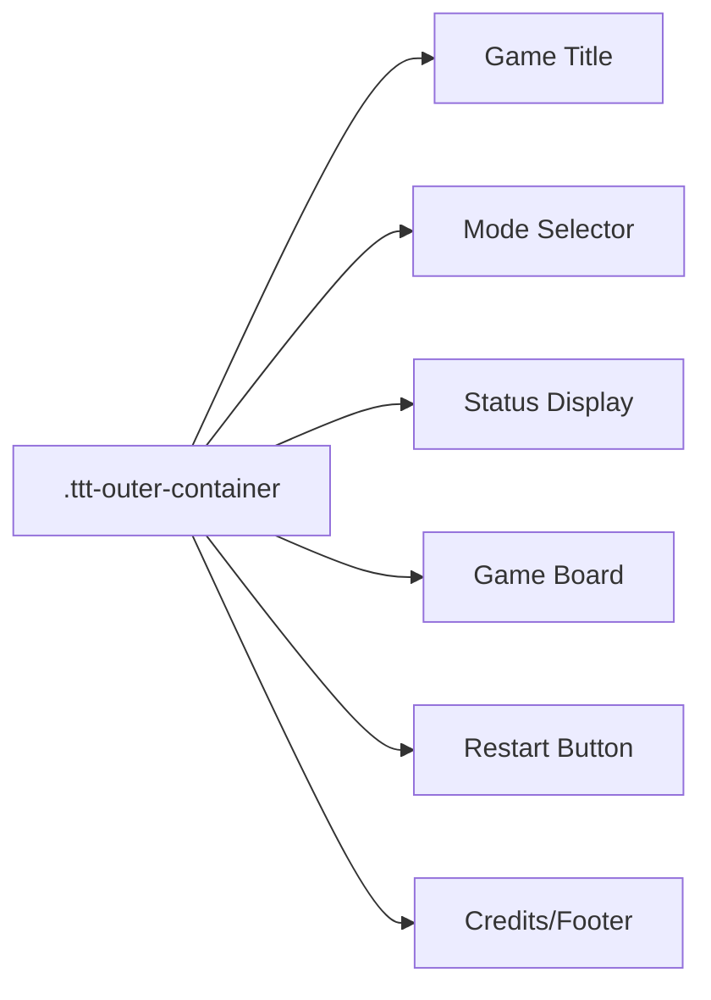

# Tic Tac Toe Frontend Architecture

This document provides an in-depth overview of the architecture for the Tic Tac Toe React frontend, focusing on app structure, main components and their roles, state management, UI layout and styling, mode handling, and restart mechanics.

---

## 1. App Structure Overview

The frontend is built with React and features a lightweight, modern, responsive UI. The entry point is `src/App.js`, which acts as both the main component and the orchestrator for rendering subcomponents, handling game logic, and managing application state.

- **Single file component structure**: All the main game logic and subcomponents are managed within `App.js` (there aren't multiple separate component files).
- **Styling**: Modern, responsive design achieved via plain CSS in `src/App.css` using CSS variables.
- **No UI frameworks**: The UI is custom-built using React and CSS, without third-party component libraries.

---

## 2. Component Breakdown and Roles

### 2.1 High-Level Component Map

The logical components rendered by `App`:

- **Game Mode Selector**: Dropdown to choose between Player vs Player and Player vs AI
- **Status Display**: Shows current turn, win, or draw status
- **Game Board**: 3x3 grid of interactive squares for gameplay
- **Restart Control**: Button to restart the current game
- **Credits/Footer**: Branding information

These are implemented as JSX subcomponents/functions inside `App.js`.

### 2.2 Mermaid Diagram: Logical Component Structure



---

### 2.3 Component Responsibilities

- **App**
  - Holds global game state (board, mode, player turn, status, etc.)
  - Contains all logic for moves, AI, win/draw determination.
  - Renders all subcomponents.
- **Mode Selector**
  - Dropdown for switching between Player vs Player and Player vs AI.
  - On mode change, restarts the game (user-confirms).
- **Status Display**
  - Displays whose turn it is, game results (win/draw), and updates in real-time.
- **Game Board**
  - 3x3 grid. Each square is a button.
  - Handles player/AI move input. Shows win/draw highlights.
- **Restart Control**
  - Button to reset the board and game state.
  - Disabled while AI turn is being computed.
- **Credits/Footer**
  - Appended branding for KAVIA and React.

---

## 3. Data Flow and State Management

### 3.1 State Variables

All core state is managed in `App` using React hooks:

- `mode`: ("pvp" or "ai"), tracks the selected gameplay mode.
- `squares`: Array of 9 representing the 3x3 board state (`X`, `O`, or `null`).
- `xIsNext`: Boolean, controls who moves next.
- `status`: String, dynamically computed game status for display.
- `gameOver`: Boolean, true if the game finished (win or draw).
- `winningLine`: Indices for highlight on victory.
- `aiThinking`: For AI mode, disables interaction while AI 'thinks'.

### 3.2 Main Data Flow

- User selects a mode in Mode Selector → `mode`/board state is reset.
- User clicks on a square → `handleSquareClick` updates `squares` and toggles `xIsNext`.
- After each move, `useEffect` checks `calculateWinner`, updates status/gameOver.
- If in "AI" mode and it's O's turn (AI), AI computes the move after a delay, then updates the board.
- Restart button resets all game state.

### 3.3 Mermaid Diagram: Data & Control Flow

```mermaid
flowchart TD
  A[User interacts:<br/>mode select,<br/>board square,<br/>restart] -->|Handler functions| B(App State Hooks)
  B -->|Triggers| C[useEffect: Evaluate Winner/Draw]
  C -->|Update| D[Status, gameOver, winningLine]
  C -->|If AI mode & turn| E[AI Move (timeout)]
  E -->|Updates| B
  B -->|Board, Status, etc.| F[Rendered UI]
```

#### Explanation
- All user actions are routed through handler functions in the main component, updating state.
- Side-effect hooks (`useEffect`) compute game outcome, manage AI, and keep derived display status in sync.
- Rendering is determined entirely by state variables.

---

## 4. Player vs Player and Player vs AI Mode Handling

- **Mode is managed via a dropdown** at the top of the UI.
- On mode change, the board is reset.
- **Player vs Player**: Both human-controlled, alternate `X`/`O` turns.
- **Player vs AI**: User as `X`, automated AI as `O`.
   - When it's the AI's turn, UI disables user input and after a short visual delay an AI move is computed by random selection of available squares.
   - The player cannot interact with the board during the AI's turn.
- Win/draw logic is identical in both modes.
- Status display adapts to indicate "Your turn (X)" or "AI's turn (O)" as appropriate.

---

## 5. UI Layout, Styling, and Responsiveness

- **Centralized container**: The game UI is placed in a centered, card-like container for focus.
- **Responsive CSS**: Uses CSS variables and media queries for mobile adaptation (`src/App.css`).
- **Color theme**:
  - `--primary` (#1976d2) — used for "X" moves, titles, win status.
  - `--accent` (#ff9800) — used for "O" moves, highlights, accent backgrounds.
  - `--secondary` (#ffffff) — overall background and board.
- **Visual elements**:
  - Subtle shadows, padding, rounded corners for modern look.
  - Interactive feedback: hover/focus transitions, win animations.
- **Accessibility**:
  - Keyboard navigation and proper ARIA labeling on squares.
- **No dark mode** (theme is fixed to light).

### 5.1 Mermaid Diagram: Layout Block Map



---

## 6. Restart Mechanism

- "Restart Game" button is always visible below the board.
- Clicking restart resets the game state—board, turn counter, status, AI state.
- If "Player vs AI" mode is active, AI does _not_ get a free move first; player always starts.
- Restart is also triggered when switching game modes (with a browser confirm dialog).

---

## 7. Key Interactions and User Flow

1. App loads with default "Player vs Player" mode.
2. User may switch mode at any time (with confirm dialog) — triggers board reset.
3. Players alternate turns with immediate visual feedback.
4. When one player (or AI) wins or the board is full, display shows outcome; inputs are locked.
5. Restart returns to the initial state for a new game.

---

## 8. Summary

The Tic Tac Toe frontend leverages React's functional paradigm and hooks to manage all state and effects, wrapped in a minimal and modern UI that is fully responsive and themed according to brand requirements. The logic, UI rendering, and controls are tightly coupled for simplicity and user accessibility. The design prioritizes clarity, immediate feedback, and ease of use on all devices.

---

### Sources

- `src/App.js`
- `src/App.css`
- `src/index.js`
